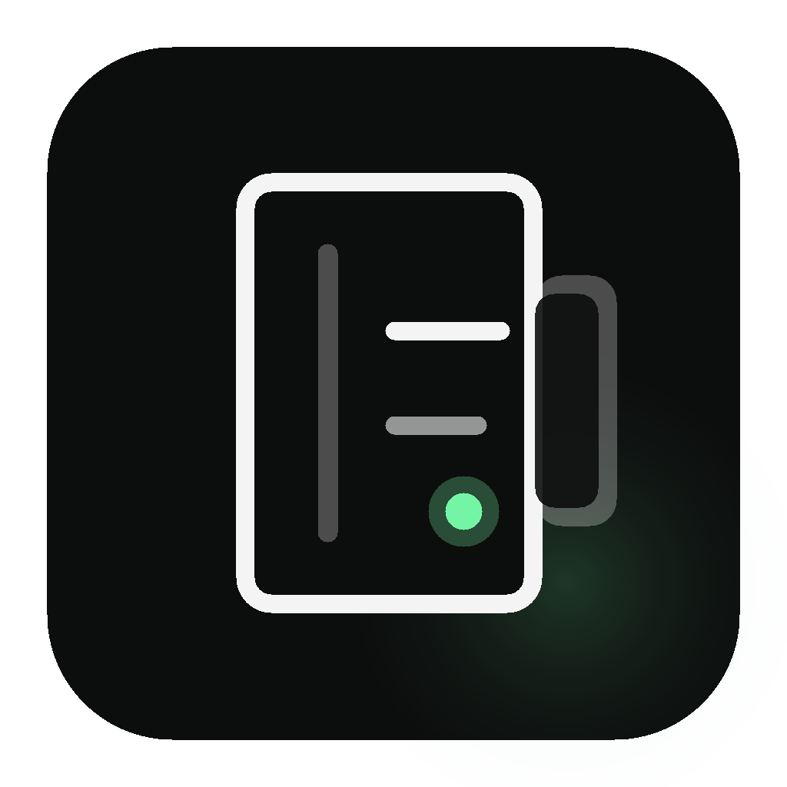

# Codex Logbook

<p align="center">
  
</p>

<p align="center">
  <strong>A privacy-first dashboard for understanding your OpenAI Codex logs, tokens, costs, projects, and workflow patterns.</strong>
</p>

<p align="center">
  <a href="LICENSE"></a>
  
  
  
  
</p>

<p align="center">
  <a href="#quickstart">Quickstart</a> ·
  <a href="#why-codex-logbook">Why Codex Logbook</a> ·
  <a href="#features">Features</a> ·
  <a href="#privacy">Privacy</a> ·
  <a href="#development">Development</a>
</p>

<p align="center">
  
</p>

Codex Logbook turns local Codex logs into a clear analytics dashboard for token usage, estimated cost, tool activity, command behavior, project health, and workflow quality. It helps heavy Codex users understand where time, context, and tokens go without sending logs to a third-party analytics service.

## Quickstart

Requirement: **Python 3.10+**

### From Source

```bash
git clone https://github.com/Smeet97Kathiria/codex-logbook.git
cd codex-logbook

python3 -m venv .venv
source .venv/bin/activate

python -m pip install --upgrade pip
python -m pip install -e .
codex-logbook init
```

Open the dashboard at:

```text
http://127.0.0.1:8081
```

### With uv

```bash
uvx codex-logbook@latest init
```

Or install it as a uv tool:

```bash
uv tool install codex-logbook@latest
codex-logbook init
```

### With pip

```bash
pip install codex-logbook
codex-logbook init
```

## Why Codex Logbook

Codex is powerful, but heavy usage can become hard to reason about. Your local logs contain useful signals:

- Which projects are using the most tokens?
- Where are estimated costs concentrated?
- Which prompts create long tool chains?
- How often does Codex need tools to complete work?
- Which projects are active, stale, expensive, or context-heavy?
- Where can better prompts reduce token waste?

Codex Logbook makes those patterns visible so you can review usage, compare projects, plan token budgets, and improve your Codex workflow over time.

## Features

- **Project overview**: Compare detected Codex projects by activity, duration, cost, commands, token volume, and data status.
- **Token analytics**: Track input and output token volume over time and by project.
- **Cost visibility**: Estimate direct API cost from token usage.
- **Tool diagnostics**: See tool-use rate, tools per command, tool trends, and long command chains.
- **Command analysis**: Review user commands, step counts, tool counts, models, token estimates, and interruptions.
- **Message explorer**: Search and inspect parsed conversation messages.
- **JSONL viewer**: Inspect source log lines when you need exact evidence.
- **Local-first dashboard**: Process logs on your machine and serve the dashboard locally.
- **Optional sharing**: Create shared dashboard links only when you explicitly choose to share.

## Privacy

> Codex Logbook is local-first by default. No telemetry. No background uploads. Your Codex logs stay on your machine unless you explicitly create a share link.

- Local log processing
- Local dashboard by default
- No tracking scripts
- No usage telemetry
- No background upload
- Optional share workflow for intentionally published dashboards

Always review command text before sharing. Your commands may include private project details, file paths, or sensitive context.

## What You Can See

Codex Logbook gives you practical metrics for understanding real Codex usage:

| Area | What it helps you understand |
| --- | --- |
| Token volume | Which projects consume the most input/output tokens |
| Estimated cost | Where direct API cost would concentrate |
| Tool usage | How often Codex relies on terminal, file, or browser tools |
| Steps per command | Which requests create long execution chains |
| Prompt cache read | How much context reuse appears in your logs |
| Project activity | Which projects are active, stale, or data-heavy |
| Command history | Which requests produced expensive or complex sessions |

## Dashboard Tour

The dashboard is designed for fast scanning across projects and deep inspection inside a single project. Screenshots below keep the owner/path context visible while masking project-name suffixes for public sharing.

<p align="center">
  
</p>

<p align="center">
  <strong>Project analytics:</strong> inspect command behavior, tool use, interruption rate, cache reads, and cost signals inside a project.
</p>

<p align="center">
  
</p>

<p align="center">
  <strong>Chart breakdowns:</strong> review tool trends, daily costs, token usage, and tool distribution for better Codex workflow decisions.
</p>

## Perfect For

- Developers who use Codex daily
- Builders tracking token usage and cost patterns
- Teams reviewing AI coding workflows
- Power users optimizing prompts and context habits
- Anyone who wants local analytics without giving up control of their logs

## How It Works

Codex Logbook reads local Codex data, exports dashboard-ready project logs, computes analytics, and starts a local web dashboard.

By default it looks for:

```text
~/.codex/state_5.sqlite
```

Generated dashboard data is written under:

```text
~/.codex-logbook/codex/projects
```

Use a custom Codex home:

```bash
CODEX_HOME=/path/to/.codex codex-logbook init
```

Use a custom export directory:

```bash
CODEX_LOGBOOK_EXPORT_DIR=/path/to/codex-logbook-projects codex-logbook init
```

## Configuration

```bash
# Change port
codex-logbook config set port 8090

# Disable auto-opening the browser
codex-logbook config set auto_browser false

# Show current configuration
codex-logbook config show
```

Common options:

| Key | Default | Description |
| --- | --- | --- |
| `port` | `8081` | Local dashboard port |
| `host` | `127.0.0.1` | Local dashboard host |
| `auto_browser` | `true` | Open browser automatically |
| `cache_max_projects` | `5` | Max projects kept in memory cache |
| `cache_max_mb_per_project` | `500` | Max memory per project cache |
| `messages_initial_load` | `500` | Initial message rows loaded |
| `max_date_range_days` | `30` | Max selectable chart date range |

See [docs/cli-reference.md](docs/cli-reference.md) for the full CLI reference.

## What To Look For

Use Codex Logbook during weekly reviews or after major project work:

- **High token volume**: Find projects where prompts, context, or repeated work may need cleanup.
- **High cost estimates**: Understand where direct API usage would be expensive.
- **Long step chains**: Spot vague requests that send Codex through unnecessary loops.
- **Low commands per context**: Identify work that quickly fills context windows.
- **High tool-use rate**: Understand which projects require heavy filesystem, terminal, or browser work.
- **Interruption patterns**: Find commands that frequently need manual correction or stopping.

Better visibility leads to better prompts, cleaner sessions, and smarter token decisions.

## Troubleshooting

Port already in use:

```bash
codex-logbook init --port 8090
```

Browser did not open:

```bash
codex-logbook config set auto_browser true
codex-logbook init
```

Codex data not found:

```bash
ls ~/.codex/state_5.sqlite
CODEX_HOME=/path/to/.codex codex-logbook init
```

Show all configuration:

```bash
codex-logbook config show
```

## Development

```bash
git clone https://github.com/Smeet97Kathiria/codex-logbook.git
cd codex-logbook

python3 -m venv .venv
source .venv/bin/activate
python -m pip install --upgrade pip
python -m pip install -e ".[dev]"
```

Run tests:

```bash
python -m pytest tests/codex_logbook --ignore=tests/codex_logbook/test_performance.py
```

Run the local app:

```bash
codex-logbook init --no-browser
```

Then open:

```text
http://127.0.0.1:8081
```

## Support The Project

If Codex Logbook helps you understand your Codex usage, please star the repo so more Codex users can discover a privacy-first way to analyze their workflow.

## License

MIT License. See [LICENSE](LICENSE).
