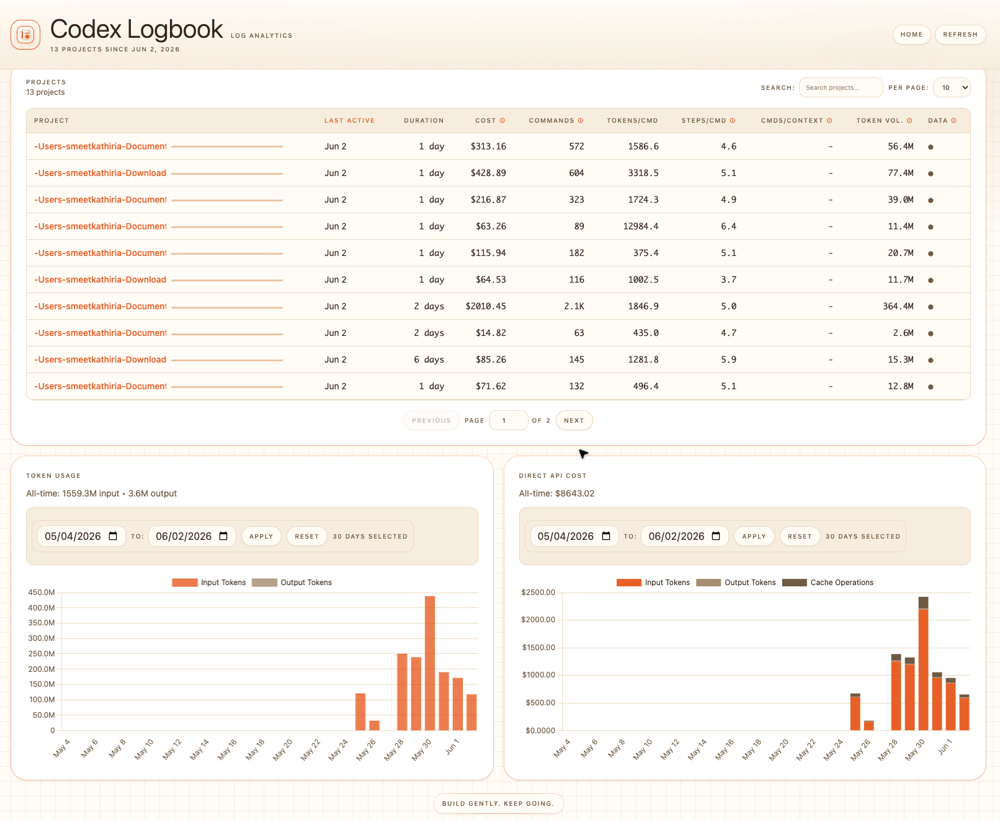
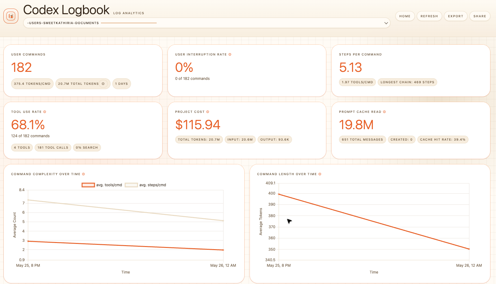
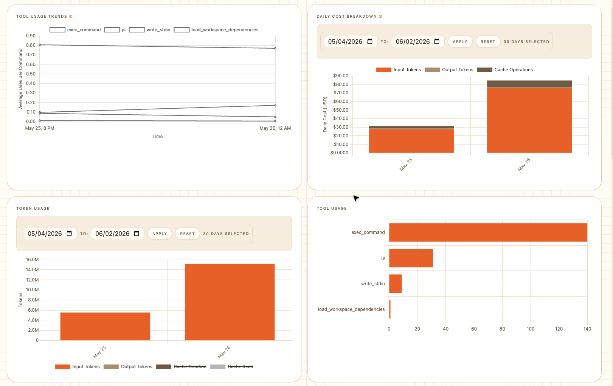

# Codex Logbook

**Codex Logbook turns your local Codex logs into a clear analytics dashboard for tokens, cost, tool usage, project activity, and workflow quality.**

If you use OpenAI Codex every day, your logs contain signals that can help you work smarter: which projects consume the most context, which prompts trigger long tool chains, where costs concentrate, and how your command patterns change over time. Codex Logbook makes those signals visible.

[Quickstart](#quickstart) · [Why Use It](#why-use-it) · [Features](#features) · [Privacy](#privacy) · [Development](#development) · [License](#license)

## Why Use It

Codex is powerful, but heavy usage can become hard to reason about. Codex Logbook helps you answer practical questions:

- Which projects are using the most tokens?
- How much would this work cost through direct API pricing?
- Which workflows create the longest command chains?
- How often does Codex need tools to complete a request?
- Which projects are active, stale, expensive, or context-heavy?
- Where can you adjust prompts to reduce token waste?

Use it to review your own usage, compare projects, plan token budgets, and make better decisions when working with Codex.

## Features

- **Project overview**: See all detected Codex projects, last activity, duration, cost, commands, token volume, and data status.
- **Token analytics**: Track input/output token volume over time and by project.
- **Cost visibility**: Estimate direct API cost from token usage.
- **Tool usage diagnostics**: See tool-use rate, tools per command, tool trends, and long command chains.
- **Command analysis**: Review user commands, step counts, tool counts, models, token estimates, and interruptions.
- **Message explorer**: Search and inspect parsed conversation messages.
- **JSONL viewer**: Inspect source log lines when you need exact evidence.
- **Local-first dashboard**: Process logs on your machine and serve the dashboard locally.
- **Share workflow**: Create optional shared dashboard links when you explicitly choose to share.

## Screenshots

The dashboard is designed for fast scanning across projects and deep inspection inside a single project. Screenshots below keep the owner/path context visible while masking project-name suffixes for public sharing.

<p align="center">
  
</p>

<p align="center">
  <strong>Project overview:</strong> compare cost, command count, tokens per command, step depth, and token volume across Codex projects.
</p>

<p align="center">
  
</p>

<p align="center">
  <strong>Project analytics:</strong> inspect command behavior, tool use, interruption rate, cache reads, and cost signals inside a project.
</p>

<p align="center">
  
</p>

<p align="center">
  <strong>Chart breakdowns:</strong> review tool trends, daily costs, token usage, and tool distribution for better Codex workflow decisions.
</p>

## Quickstart

Requirement: **Python 3.10+**

### From Source

```bash
git clone https://github.com/smeetkathiria/codex-logbook.git
cd codex-logbook

python3 -m venv .venv
source .venv/bin/activate

python -m pip install --upgrade pip
python -m pip install -e .
codex-logbook init
```

Open the dashboard at:

```text
http://127.0.0.1:8081
```

### With uv

```bash
uvx codex-logbook@latest init
```

Or install it as a uv tool:

```bash
uv tool install codex-logbook@latest
codex-logbook init
```

### With pip

```bash
pip install codex-logbook
codex-logbook init
```

## How It Works

Codex Logbook reads local Codex data, exports dashboard-ready project logs, computes analytics, and starts a local web dashboard.

By default it looks for:

```text
~/.codex/state_5.sqlite
```

Generated dashboard data is written under:

```text
~/.codex-logbook/codex/projects
```

Use a custom Codex home:

```bash
CODEX_HOME=/path/to/.codex codex-logbook init
```

Use a custom export directory:

```bash
CODEX_LOGBOOK_EXPORT_DIR=/path/to/codex-logbook-projects codex-logbook init
```

## Configuration

```bash
# Change port
codex-logbook config set port 8090

# Disable auto-opening the browser
codex-logbook config set auto_browser false

# Show current configuration
codex-logbook config show
```

Common options:

| Key | Default | Description |
| --- | --- | --- |
| `port` | `8081` | Local dashboard port |
| `host` | `127.0.0.1` | Local dashboard host |
| `auto_browser` | `true` | Open browser automatically |
| `cache_max_projects` | `5` | Max projects kept in memory cache |
| `cache_max_mb_per_project` | `500` | Max memory per project cache |
| `messages_initial_load` | `500` | Initial message rows loaded |
| `max_date_range_days` | `30` | Max selectable chart date range |

See [docs/cli-reference.md](docs/cli-reference.md) for the full CLI reference.

## What To Look For

Use Codex Logbook during weekly reviews or after major project work:

- **High token volume**: Find projects where prompts, context, or repeated work may need cleanup.
- **High cost estimates**: Understand where direct API usage would be expensive.
- **Long step chains**: Spot vague requests that send Codex through unnecessary loops.
- **Low commands per context**: Identify work that quickly fills context windows.
- **High tool-use rate**: Understand which projects require heavy filesystem, terminal, or browser work.
- **Interruption patterns**: Find commands that frequently need manual correction or stopping.

Better visibility leads to better prompts, cleaner sessions, and smarter token decisions.

## Privacy

Codex Logbook is local-first:

- Local log processing
- Local dashboard by default
- No telemetry
- No background upload
- Shared dashboards only when you explicitly create a share link

Always review command text before sharing. Your commands may include private project details.

## Troubleshooting

Port already in use:

```bash
codex-logbook init --port 8090
```

Browser did not open:

```bash
codex-logbook config set auto_browser true
codex-logbook init
```

Codex data not found:

```bash
ls ~/.codex/state_5.sqlite
CODEX_HOME=/path/to/.codex codex-logbook init
```

Show all configuration:

```bash
codex-logbook config show
```

## Development

```bash
git clone https://github.com/smeetkathiria/codex-logbook.git
cd codex-logbook

python3 -m venv .venv
source .venv/bin/activate
python -m pip install --upgrade pip
python -m pip install -e ".[dev]"
```

Run tests:

```bash
python -m pytest tests/codex_logbook --ignore=tests/codex_logbook/test_performance.py
```

Run the local app:

```bash
codex-logbook init --no-browser
```

Then open:

```text
http://127.0.0.1:8081
```

## Support The Project

If Codex Logbook helps you understand your Codex usage, optimize token spend, or improve your coding-agent workflow, please star the repository on GitHub. Stars help more OpenAI Codex users discover the project and make better decisions with their own data.

## License

MIT License. See [LICENSE](LICENSE).
